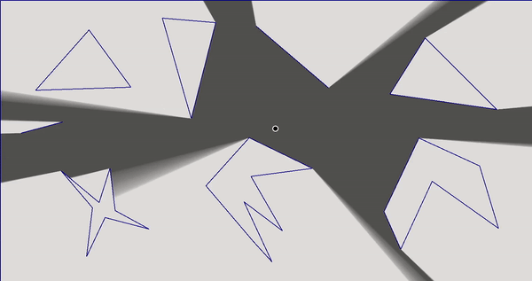
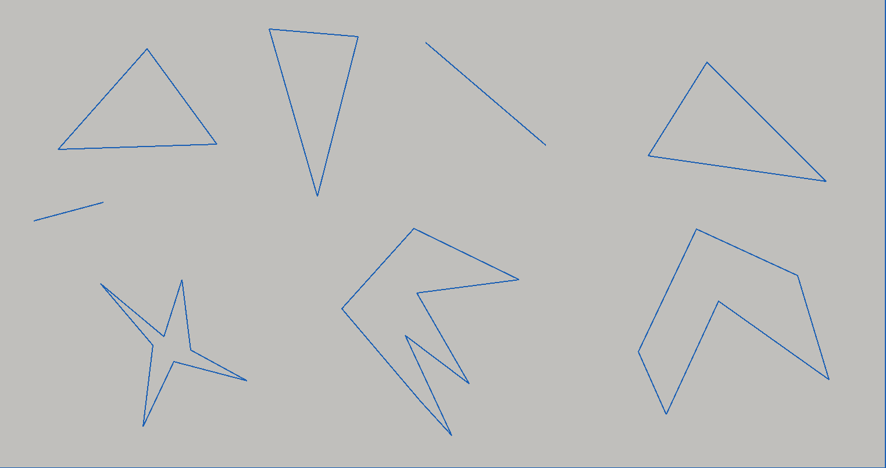
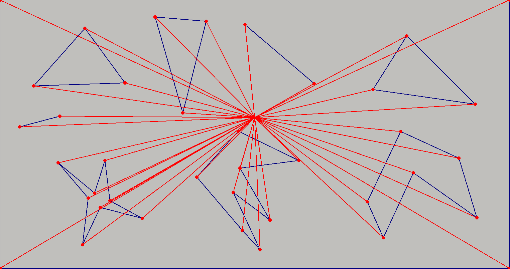
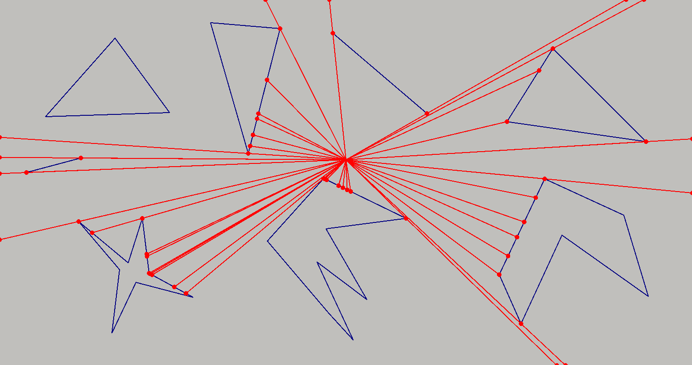
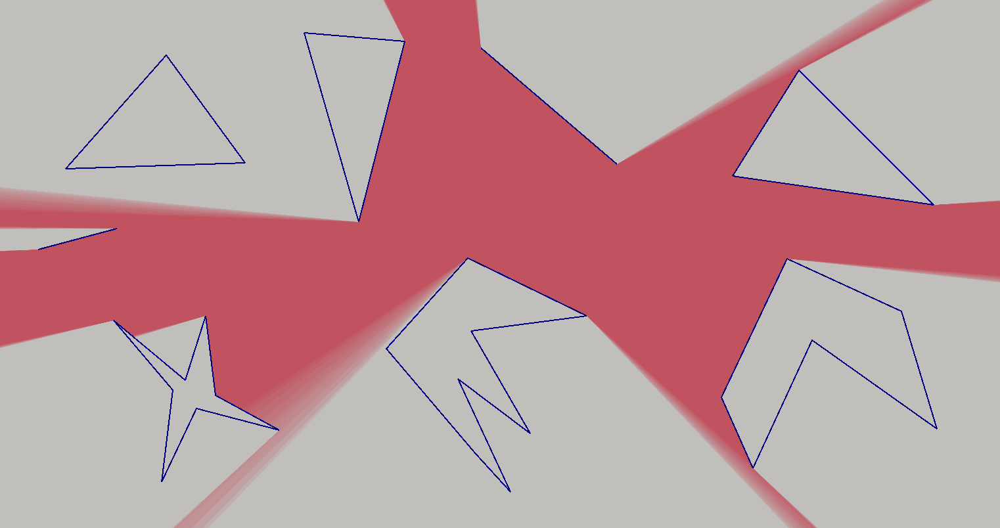

# 2D Raycaster

Simple 2D raycasting program written in C++.

## Example:

## How it works:

- ### Fist step: Polygons:
  

  Draw polygons, which represent walls to block light and one "fake" polygon
  which serves as a border.

- ### Second step: Rays:
   

  Cast rays form light source point to each polygon's vertices + for each ray
  cast 2 copies rotated by +- 0.0001 radian.

- ### Third step: Intersection:
   

  Find intersection point for all rays and all polygons and for each ray save
  the closest one to light source.

- ### Fourth Step: Light:
   

  Connect all points and fill it to draw lighted area.

- ### Fifths step: "Fuzzy" shadows:
  

  You can add more light sources to create "fuzzy" shadows.

  There are 20 additional light sources on image, which are located in circle
  shape, center of which is original light source. 

